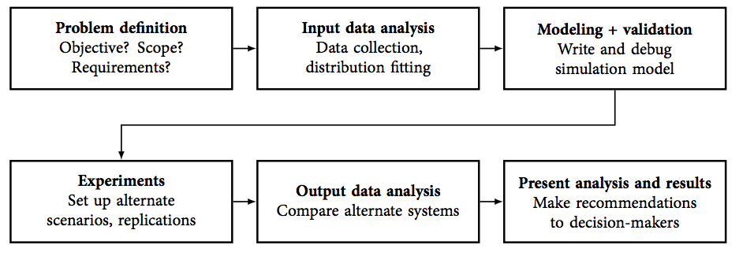

# Putting it all together

- In Lesson 1, we discussed the typical steps in a simulation study:



- Now that we've learned the basics of these steps, it's time to put everything together

- A complete report of a simulation study should contain the following sections, in this order:

    1. __Problem Statement.__ See below.
    
    2. __Input Data Analysis.__ See Lesson 6.
    
    3. __Model and Experimental Setup.__ See below.
    
    4. __Output Data Analysis.__ See Lesson 5. 
    
    5. __Conclusion.__ See below. 
    

## Writing the problem statement 

- The problem statement should include the following: 

    - What is the system you are studying? How does the system currently operate?

    - What are the goals that your client wants to accomplish?
    
    - What is the purpose of your study? In particular:
        - What alternatives did you investigate? 
        - What performance measures did you compute?
        - How do these alternatives and performance measures help the client with their objective?


## Describing your model and experiments

- Your description of your simulation model and experimental setup should include:

    - A flow chart of how your system operates, according to your simulation model
    
    - Assumptions about how your system operates
        - For example, what aspects of the system have been excluded from your simulation model?
    
    - The alternatives tested (e.g. number of baristas)
    
    - Number of replications run for each alternative


## Writing the conclusion

- Your conclusion should include:

    - A summary of the most important points from your output data analysis
  
    - Guidance for action based on your output data analysis, with a clear caveat that your conclusions are based on the assumptions of your simulation study. For example,  
  
        > Based on our simulation, ... (fill in later) 

    - Important limitations of your simulation study


# Making your report presentable

## Hide your code and raw output 

- Rule of thumb: your report should __not__ include any code or raw output

    - Exceptions: you're writing a report that is teaches the reader about how to write code

- Up to this point, we've been pretty lax about including code and other "detritus" in our reports

- It turns out it's pretty easy to hide this stuff - consider the following chunk:

```{r}
print("Hello world")
```

- To hide the __code__ from your report, change `{r}` in the first line of the chunk to `{r echo=FALSE}`

- To hide the __output__ from your report, change `{r}` in the first line of the chunk to `{r include=FALSE}`

- You can do both simultaneously with `{r echo=FALSE, include=FALSE}`

## Organize your report into sections

- Organize your report into sections. You can start a new section or subsection in R Markdown by starting a new line with some number of `#`s, like this:

# A section

## A subsection

### A subsubsection

#### A subsubsubsection


# What's next?

- More __simulation modeling concepts__ in JaamSim, for example:

    - balking and reneging
    
    - queueing discipline
    
    - using multiple resources simultaneously
    
    - inventory levels

- __Projects.__ You will conduct complete simulation studies of systems that require these modeling concepts, and write reports about your process and findings. 

- An interlude on __simulation theory__

    - How are random numbers generated? How do we sample from a particular distribution? 
    
    - How can we improve the predictions that result from our simulation experiments?
